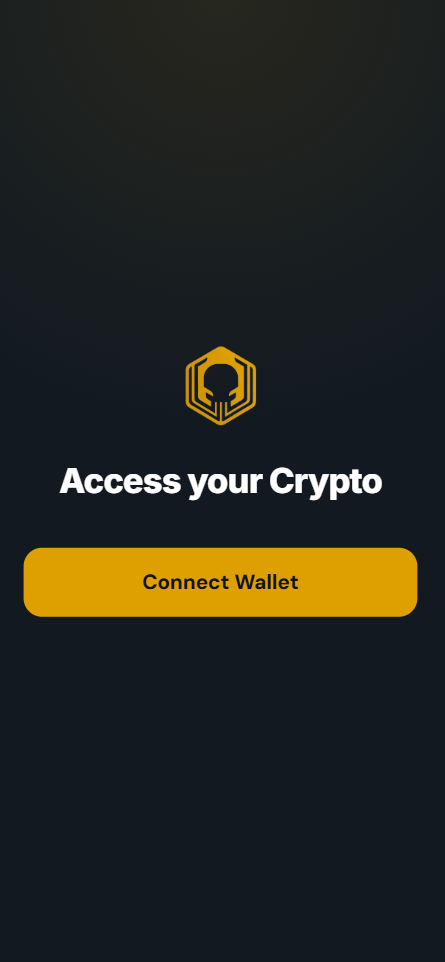
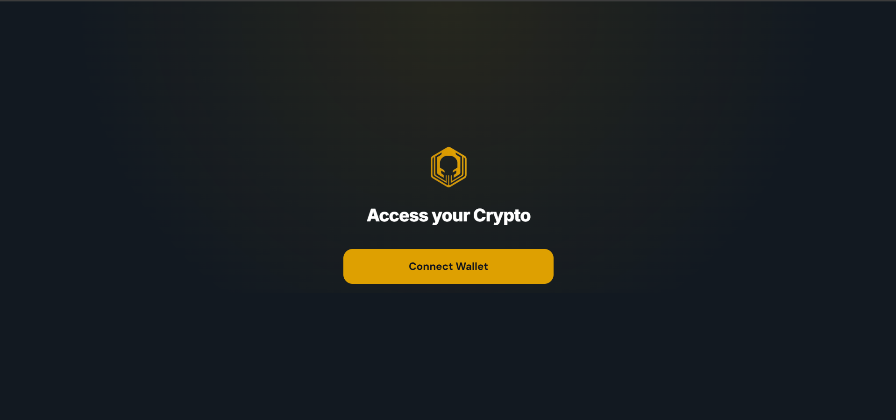

# Xpectre Wallet — Solana Web3 dApp

Xpectre Wallet is a decentralized application (dApp) built on Solana, designed to provide a fast, secure, and seamless experience for managing crypto assets and connecting to Web3. This project is built on top of the official [Solana dApp Scaffold Next](https://github.com/solana-labs/dapp-scaffold), extended with a custom design system, transaction history, token swaps, security features, and E2E testing.

| Responsive | Desktop |
| :---: | :---: |
|  |  |

---

## Tech Stack

- **Next.js** (Pages Router) + **TypeScript**
- **Tailwind CSS**
- **Solana Web3.js** + **Wallet Adapter** (Phantom, Solflare)
- **Jupiter API** for token swaps
- **Playwright** for E2E testing

---

## Getting Started

This is a [Next.js](https://nextjs.org/) project bootstrapped with [`create-next-app`](https://github.com/vercel/next.js/tree/canary/packages/create-next-app) and built on the Solana dApp Scaffold, configured for the Solana ecosystem.

### Installation

```bash
npm install
# or
yarn install
```

### Build and Run

Run the development server:

```bash
npm run dev
# or
yarn dev
```

Open [http://localhost:3000](http://localhost:3000) with your browser to see the result.

You can start editing the page by modifying `pages/index.tsx`. The page auto-updates as you edit the file.

[API routes](https://nextjs.org/docs/api-routes/introduction) can be accessed on [http://localhost:3000/api/hello](http://localhost:3000/api/hello). This endpoint can be edited in `pages/api/hello.ts`. The `pages/api` directory is mapped to `/api/*`; files in this directory are treated as API routes instead of React pages.

---

## Project Structure

```
├── public         : publicly hosted assets
├── src            : primary source code
│   ├── components : reusable UI components
│   ├── contexts   : React contexts for global state (wallet, network, autoconnect)
│   ├── hooks      : custom React hooks (transaction history, clipboard, etc.)
│   ├── models     : shared TypeScript types
│   ├── pages      : Next.js routes and page entry points
│   ├── stores     : Zustand stores for state management (balance, notifications)
│   ├── styles     : global and reusable styles
│   ├── utils      : helper functions (Solana integration, security, explorer links, theme tokens)
│   └── views      : page-level views composed from components (home, history, market, send, settings)
```

---

## End-to-End Testing (Playwright)

This project uses [Playwright](https://playwright.dev/) for full E2E UI and Web3 interaction testing. A mock Solana wallet is injected to test critical paths securely, without requiring real browser extensions.

### 1. Environment Setup

Copy the example env file:

```bash
cp .env.example .env.test
```

Generate a local test keypair and add it to your new `.env.test` file:

```bash
node generate-test-keypair.js
```

Your `.env.test` should now have a `TEST_WALLET_SECRET_KEY` variable.

> **Note:** `.env.test` is gitignored. Never commit real secret keys — this keypair should only ever hold Devnet test funds.

### 2. Running the Tests

To execute the full E2E test suite (main wallet flow, mobile responsiveness, and UI error handling):

```bash
yarn playwright test
```

### 3. Viewing the Results

To see video recordings and traces of every test run:

```bash
yarn playwright show-report
```

---

## Contributing

Anyone is welcome to open an issue to discuss, build, or request a feature. Please follow the existing project architecture and style when contributing.

1. Fork the repo on GitHub
2. Clone the project to your own machine
3. Commit changes to your own branch
4. Push your work back up to your fork
5. Submit a Pull Request so we can review your changes

**NOTE**: Be sure to merge the latest from "upstream" before making a pull request!

---

## Learn More

To learn more about Next.js, take a look at the following resources:

- [Next.js Documentation](https://nextjs.org/docs) — learn about Next.js features and API.
- [Learn Next.js](https://nextjs.org/learn) — an interactive Next.js tutorial.

You can check out [the Next.js GitHub repository](https://github.com/vercel/next.js/) — your feedback and contributions are welcome.

## Deploy on Vercel

The easiest way to deploy this Next.js app is to use the [Vercel Platform](https://vercel.com/new?utm_medium=default-template&filter=next.js&utm_source=create-next-app&utm_campaign=create-next-app-readme) from the creators of Next.js.

Check out the [Next.js deployment documentation](https://nextjs.org/docs/deployment) for more details.